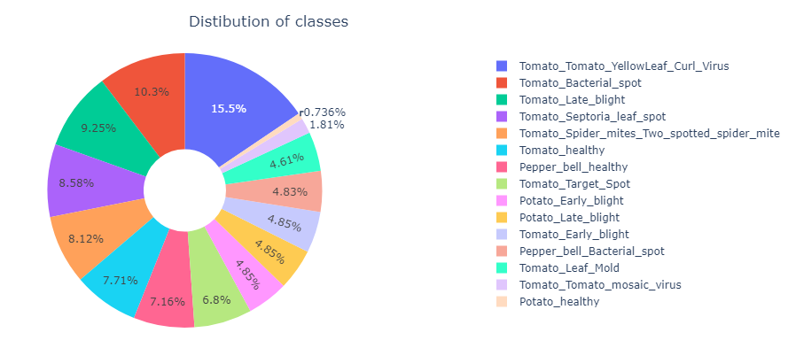
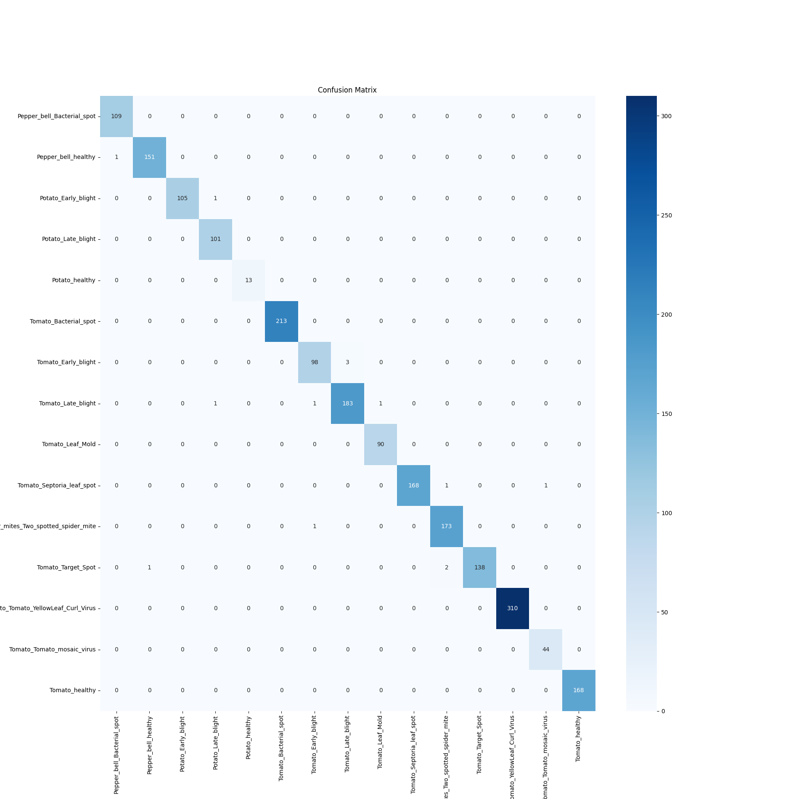

# Plant Diseases Classification
The "Plant Diseases Classification" project aims to leverage advanced computer vision techniques to detect and classify various diseases affecting plants. With the increasing need for sustainable agriculture, early detection of plant diseases plays a crucial role in minimizing crop losses and ensuring food security. This project offers a comprehensive solution that combines image processing, deep learning, and data analysis to accurately identify plant diseases based on visual symptoms.

## Description
The menace of plant diseases threatens global food security and the sustainability of agriculture. Swift and accurate disease detection is imperative to minimize their impact on crop yields and maintain a stable food supply. This small project leverages the "Plant Village" dataset (https://www.kaggle.com/datasets/arjuntejaswi/plant-village), comprising 20,000 images categorized into 15 disease classes across Potato, Tomato, and Pepper plants. Employing Transfer Learning via a CNN architecture yielded remarkable outcomes. The model achieved a commendable **0.99 weighted mean AUC-ROC score**. Notably, the model encompassed around 50,000 parameters, with **26,000 being trainable** parameters, resulting in efficient training within 10 epochs using RTX 3050 GPU. 

## Key Features
- Utilizes state-of-the-art deep learning models for image classification.
- Supports multi-class classification of plant diseases across a diverse range of crops.
- Offers insights into disease prevalence, distribution, and severity through data visualization.
- Enables further customization and expansion with easy-to-follow code and documentation.

## Libraries and framework
In this project, Tensorflow framework was used for training and evaluating model. Below are some neccessary libraries in this project:

<pre>
import os
import shutil
import time
import numpy as np
import pandas as pd
import seaborn as sns
import matplotlib.pyplot as plt
from sklearn.metrics import roc_curve, auc, roc_auc_score

import tensorflow as tf
from tensorflow import keras
from tensorflow.keras import layers, models
from tensorflow.keras import Model
from tensorflow.keras import optimizers
from tensorflow.keras.applications import ResNet50, InceptionV3, ResNet101
from tensorflow.keras.callbacks import ModelCheckpoint, TensorBoard, EarlyStopping, ReduceLROnPlateau
  
from keras.models import Sequential
from keras.layers import Dense, Dropout, Flatten, BatchNormalization
from keras.layers import Conv2D, MaxPooling2D
</pre>

## Plant Diseases Visualization
In this section, we are going to explore some aspects of the dataset. The dataset contains exactly 20638 256x256 RGB images belonging to 15 classes:

<pre>
  ['Pepper_bell_Bacterial_spot',
 'Pepper_bell_healthy',
 'Potato_Early_blight',
 'Potato_Late_blight',
 'Potato_healthy',
 'Tomato_Bacterial_spot',
 'Tomato_Early_blight',
 'Tomato_Late_blight',
 'Tomato_Leaf_Mold',
 'Tomato_Septoria_leaf_spot',
 'Tomato_Spider_mites_Two_spotted_spider_mite',
 'Tomato_Target_Spot',
 'Tomato_Tomato_YellowLeaf_Curl_Virus',
 'Tomato_Tomato_mosaic_virus',
 'Tomato_healthy']
</pre>

Potato, tomato, and pepper leaves exhibit distinct characteristics that set them apart. At first, let me describe some details about the differences between leaves of Potato, Tomato and Pepper. It is worth to know the differences between these plants before jumping into explore their diseases:
- **Potato** leaves are identifiable by their compound nature, featuring multiple leaflets arranged along a central stem. These leaflets tend to be either oval or lance-shaped, displaying shades of light to dark green and a soft texture.
- **Tomato** leaves, on the other hand, are also compound but bear serrated leaflets, often with a medium to dark green hue. These leaves possess a rough texture due to a slight hairiness.
- **Bell Pepper** leaves may have either simple or compound forms, with varying shapes such as lance, elliptical, or heart-shaped. They are typically smooth-edged and sport a medium to dark green coloration. The texture of pepper leaves is notably smoother than that of tomatoes.

  
  
  

Additionally, we can see that there are an imbalance in the data set classes, Pepper has only 2 classes of healthy one and Baterial Spotted, Potato has 3 classes with 2 diseases are Late Blight and Early Blight while Tomato has noticeable lots of diseases (10 classes). The distribution between all 15 classes is also not equal which prove this data set is skewed:

This class imbalance can impact model training and evaluation. The challenges include:
- **Overfitting**: With limited samples in some classes, models may overfit to those samples, performing poorly on unseen data.
- **Evaluation Metrics**: Traditional accuracy may not be an appropriate metric due to class imbalance. Metrics like precision, recall, and F1-score provide a more balanced evaluation which will discussed further.

## Transfer Learning and Evaluation Metrics
Several previous research studies have extensively explored the realm of plant disease classification. Some investigations have predominantly concentrated on employing image processing techniques, combined with methods like feature extraction coupled with SVM, K-Mean Clustering, or Convolutional Neural Networks (CNNs). Utilizing traditional approaches such as SVM or K-Mean in conjunction with image preprocessing has yielded quite promising outcomes, yielding accuracy levels ranging from **90% to 96%**.

However, the emergence of Deep Learning has ushered in a new era. Specialized neural network architectures, including CNNs, have shown remarkable prowess in tackling image classification tasks, often surpassing earlier methods. In CNNs, each layer can be viewed as a feature extraction layer, allowing the model to autonomously learn how to extract pertinent features from raw images rather than relying on manually-crafted, preprocessed images. This highlights the potential of end-to-end image classification, which carries numerous advantages, including streamlined and automated feature learning, reduced dependency on human-engineered features, and the ability to handle complex patterns and variations present in real-world images. 

One of the method is that to use a pre-trained model with very **deep** architectures, customize some last layers for your specific task. Using the dataset to train on only these last layers while keep the rest layers' parameters unchanged. This is called **Transfer Learning**, how does it really work?
The layers of a pre-trained model consist of a series of learned feature extractors. These extractors recognize various levels of features, from simple shapes to complex patterns. The idea is to use these learned features for your new task without the need to train them from scratch. This offer huge benefits such as:

- **Faster Training**: Since you're utilizing pre-trained features, you require fewer training examples and epochs to achieve good results.
- **Generalization**: Transfer learning helps improve the generalization of your model to new data, even with limited training data.
- **Feature Extraction**: Pre-trained models have already learned a hierarchy of features, so you don't have to build these features from scratch.
- **Domain Adaptation**: Even if the pre-trained data is slightly different from your new task's data, the features can still be relevant and useful.

The choice of which layers to freeze, how many new layers to add, and which layers to fine-tune depends on the complexity of the new task and the similarities between the original and new tasks. The initial layers focus on fundamental attributes like patterns and shapes, while the later layers become adept at discerning more intricate features that cater to specific tasks. Therefore, if you have sufficient enough dataset, you can unlock more last layers and train your data on those which can improve your training process and final model. 

In this project, I used **ResNet50** for Transfer Learning and applied various metrics as **precision**, **recall** and **AUC-ROC** for model evaluation since the data is imbalanced.

## Methods and Results
At first, the images are resized to 150x150 RGB images for an ease and fast training process. The dataset contains 20638 files belonging to 15 classes were fed into model with batch size of 64. The training process was performed by Stochastic Gradient Descent, using Adam optimizer with learning rate of 0.001, weight decay of 1e-6, loss function was determied using Sparse Categorical Crossentropy. I used many architectures to train on the dataset, however obtain final model by Transfer Learning from ResNet50 with freezing all pristine parameters in based model, *eliminate the last layer in ResNet50 based model which is Max Pooling layer*. The output of based model is flatted out and fed into a **Dense** layer with **512 nodes**, followed by a **BatchNorm** layer and end with **Softmax-15**. Here is the summary of model architecture:

<pre>
__________________________________________________________________________________________________
 Layer (type)                   Output Shape         Param #     Connected to                     
==================================================================================================
 input_4 (InputLayer)           [(None, 150, 150, 3  0           []                               
                                )]                                                                
                                                                                                  
 conv1_pad (ZeroPadding2D)      (None, 156, 156, 3)  0           ['input_4[0][0]']                
                                                                                                  
 conv1_conv (Conv2D)            (None, 75, 75, 64)   9472        ['conv1_pad[0][0]']              
                                                                                                  
 conv1_bn (BatchNormalization)  (None, 75, 75, 64)   256         ['conv1_conv[0][0]']             
                                                                                                  
 conv1_relu (Activation)        (None, 75, 75, 64)   0           ['conv1_bn[0][0]']               
                                                                                                  
 pool1_pad (ZeroPadding2D)      (None, 77, 77, 64)   0           ['conv1_relu[0][0]']             
                                                                                                  
 pool1_pool (MaxPooling2D)      (None, 38, 38, 64)   0           ['pool1_pad[0][0]']              
                                                                                                  
 conv2_block1_1_conv (Conv2D)   (None, 38, 38, 64)   4160        ['pool1_pool[0][0]']             
                                                                                                  
 conv2_block1_1_bn (BatchNormal  (None, 38, 38, 64)  256         ['conv2_block1_1_conv[0][0]']    
 ization)                                                                                         
                                                                                                  
 conv2_block1_1_relu (Activatio  (None, 38, 38, 64)  0           ['conv2_block1_1_bn[0][0]']      
 n)                                                                                               
                                                                                                  
 conv2_block1_2_conv (Conv2D)   (None, 38, 38, 64)   36928       ['conv2_block1_1_relu[0][0]']    
                                                                                                  
 conv2_block1_2_bn (BatchNormal  (None, 38, 38, 64)  256         ['conv2_block1_2_conv[0][0]']    
 ization)                                                                                         
                                                                                                  
 conv2_block1_2_relu (Activatio  (None, 38, 38, 64)  0           ['conv2_block1_2_bn[0][0]']      
 n)                                                                                               
                                                                                                  
 conv2_block1_0_conv (Conv2D)   (None, 38, 38, 256)  16640       ['pool1_pool[0][0]']             
                                                                                                  
 conv2_block1_3_conv (Conv2D)   (None, 38, 38, 256)  16640       ['conv2_block1_2_relu[0][0]']    
                                                                                                  
 conv2_block1_0_bn (BatchNormal  (None, 38, 38, 256)  1024       ['conv2_block1_0_conv[0][0]']    
 ization)                                                                                         
                                                                                                  
 conv2_block1_3_bn (BatchNormal  (None, 38, 38, 256)  1024       ['conv2_block1_3_conv[0][0]']    
 ization)                                                                                         
                                                                                                  
 conv2_block1_add (Add)         (None, 38, 38, 256)  0           ['conv2_block1_0_bn[0][0]',      
                                                                  'conv2_block1_3_bn[0][0]']      
                                                                                                  
 conv2_block1_out (Activation)  (None, 38, 38, 256)  0           ['conv2_block1_add[0][0]']       
                                                                                                  
 conv2_block2_1_conv (Conv2D)   (None, 38, 38, 64)   16448       ['conv2_block1_out[0][0]']       
                                                                                                  
 conv2_block2_1_bn (BatchNormal  (None, 38, 38, 64)  256         ['conv2_block2_1_conv[0][0]']    
 ization)                                                                                         
                                                                                                  
 conv2_block2_1_relu (Activatio  (None, 38, 38, 64)  0           ['conv2_block2_1_bn[0][0]']      
 n)                                                                                               
                                                                                                  
 conv2_block2_2_conv (Conv2D)   (None, 38, 38, 64)   36928       ['conv2_block2_1_relu[0][0]']    
                                                                                                  
 conv2_block2_2_bn (BatchNormal  (None, 38, 38, 64)  256         ['conv2_block2_2_conv[0][0]']    
 ization)                                                                                         
                                                                                                  
 conv2_block2_2_relu (Activatio  (None, 38, 38, 64)  0           ['conv2_block2_2_bn[0][0]']      
 n)                                                                                               
                                                                                                  
 conv2_block2_3_conv (Conv2D)   (None, 38, 38, 256)  16640       ['conv2_block2_2_relu[0][0]']    
                                                                                                  
 conv2_block2_3_bn (BatchNormal  (None, 38, 38, 256)  1024       ['conv2_block2_3_conv[0][0]']    
 ization)                                                                                         
                                                                                                  
 conv2_block2_add (Add)         (None, 38, 38, 256)  0           ['conv2_block1_out[0][0]',       
                                                                  'conv2_block2_3_bn[0][0]']      
                                                                                                  
 conv2_block2_out (Activation)  (None, 38, 38, 256)  0           ['conv2_block2_add[0][0]']       
                                                                                                  
 conv2_block3_1_conv (Conv2D)   (None, 38, 38, 64)   16448       ['conv2_block2_out[0][0]']       
                                                                                                  
 conv2_block3_1_bn (BatchNormal  (None, 38, 38, 64)  256         ['conv2_block3_1_conv[0][0]']    
 ization)                                                                                         
                                                                                                  
 conv2_block3_1_relu (Activatio  (None, 38, 38, 64)  0           ['conv2_block3_1_bn[0][0]']      
 n)                                                                                               
                                                                                                  
 conv2_block3_2_conv (Conv2D)   (None, 38, 38, 64)   36928       ['conv2_block3_1_relu[0][0]']    
                                                                                                  
 conv2_block3_2_bn (BatchNormal  (None, 38, 38, 64)  256         ['conv2_block3_2_conv[0][0]']    
 ization)                                                                                         
                                                                                                  
 conv2_block3_2_relu (Activatio  (None, 38, 38, 64)  0           ['conv2_block3_2_bn[0][0]']      
 n)                                                                                               
                                                                                                  
 conv2_block3_3_conv (Conv2D)   (None, 38, 38, 256)  16640       ['conv2_block3_2_relu[0][0]']    
                                                                                                  
 conv2_block3_3_bn (BatchNormal  (None, 38, 38, 256)  1024       ['conv2_block3_3_conv[0][0]']    
 ization)                                                                                         
                                                                                                  
 conv2_block3_add (Add)         (None, 38, 38, 256)  0           ['conv2_block2_out[0][0]',       
                                                                  'conv2_block3_3_bn[0][0]']      
                                                                                                  
 conv2_block3_out (Activation)  (None, 38, 38, 256)  0           ['conv2_block3_add[0][0]']       
                                                                                                  
 conv3_block1_1_conv (Conv2D)   (None, 19, 19, 128)  32896       ['conv2_block3_out[0][0]']       
                                                                                                  
 conv3_block1_1_bn (BatchNormal  (None, 19, 19, 128)  512        ['conv3_block1_1_conv[0][0]']    
 ization)                                                                                         
                                                                                                  
 conv3_block1_1_relu (Activatio  (None, 19, 19, 128)  0          ['conv3_block1_1_bn[0][0]']      
 n)                                                                                               
                                                                                                  
 conv3_block1_2_conv (Conv2D)   (None, 19, 19, 128)  147584      ['conv3_block1_1_relu[0][0]']    
                                                                                                  
 conv3_block1_2_bn (BatchNormal  (None, 19, 19, 128)  512        ['conv3_block1_2_conv[0][0]']    
 ization)                                                                                         
                                                                                                  
 conv3_block1_2_relu (Activatio  (None, 19, 19, 128)  0          ['conv3_block1_2_bn[0][0]']      
 n)                                                                                               
                                                                                                  
 conv3_block1_0_conv (Conv2D)   (None, 19, 19, 512)  131584      ['conv2_block3_out[0][0]']       
                                                                                                  
 conv3_block1_3_conv (Conv2D)   (None, 19, 19, 512)  66048       ['conv3_block1_2_relu[0][0]']    
                                                                                                  
 conv3_block1_0_bn (BatchNormal  (None, 19, 19, 512)  2048       ['conv3_block1_0_conv[0][0]']    
 ization)                                                                                         
                                                                                                  
 conv3_block1_3_bn (BatchNormal  (None, 19, 19, 512)  2048       ['conv3_block1_3_conv[0][0]']    
 ization)                                                                                         
                                                                                                  
 conv3_block1_add (Add)         (None, 19, 19, 512)  0           ['conv3_block1_0_bn[0][0]',      
                                                                  'conv3_block1_3_bn[0][0]']      
                                                                                                  
 conv3_block1_out (Activation)  (None, 19, 19, 512)  0           ['conv3_block1_add[0][0]']       
                                                                                                  
 conv3_block2_1_conv (Conv2D)   (None, 19, 19, 128)  65664       ['conv3_block1_out[0][0]']       
                                                                                                  
 conv3_block2_1_bn (BatchNormal  (None, 19, 19, 128)  512        ['conv3_block2_1_conv[0][0]']    
 ization)                                                                                         
                                                                                                  
 conv3_block2_1_relu (Activatio  (None, 19, 19, 128)  0          ['conv3_block2_1_bn[0][0]']      
 n)                                                                                               
                                                                                                  
 conv3_block2_2_conv (Conv2D)   (None, 19, 19, 128)  147584      ['conv3_block2_1_relu[0][0]']    
                                                                                                  
 conv3_block2_2_bn (BatchNormal  (None, 19, 19, 128)  512        ['conv3_block2_2_conv[0][0]']    
 ization)                                                                                         
                                                                                                  
 conv3_block2_2_relu (Activatio  (None, 19, 19, 128)  0          ['conv3_block2_2_bn[0][0]']      
 n)                                                                                               
                                                                                                  
 conv3_block2_3_conv (Conv2D)   (None, 19, 19, 512)  66048       ['conv3_block2_2_relu[0][0]']    
                                                                                                  
 conv3_block2_3_bn (BatchNormal  (None, 19, 19, 512)  2048       ['conv3_block2_3_conv[0][0]']    
 ization)                                                                                         
                                                                                                  
 conv3_block2_add (Add)         (None, 19, 19, 512)  0           ['conv3_block1_out[0][0]',       
                                                                  'conv3_block2_3_bn[0][0]']      
                                                                                                  
 conv3_block2_out (Activation)  (None, 19, 19, 512)  0           ['conv3_block2_add[0][0]']       
                                                                                                  
 conv3_block3_1_conv (Conv2D)   (None, 19, 19, 128)  65664       ['conv3_block2_out[0][0]']       
                                                                                                  
 conv3_block3_1_bn (BatchNormal  (None, 19, 19, 128)  512        ['conv3_block3_1_conv[0][0]']    
 ization)                                                                                         
                                                                                                  
 conv3_block3_1_relu (Activatio  (None, 19, 19, 128)  0          ['conv3_block3_1_bn[0][0]']      
 n)                                                                                               
                                                                                                  
 conv3_block3_2_conv (Conv2D)   (None, 19, 19, 128)  147584      ['conv3_block3_1_relu[0][0]']    
                                                                                                  
 conv3_block3_2_bn (BatchNormal  (None, 19, 19, 128)  512        ['conv3_block3_2_conv[0][0]']    
 ization)                                                                                         
                                                                                                  
 conv3_block3_2_relu (Activatio  (None, 19, 19, 128)  0          ['conv3_block3_2_bn[0][0]']      
 n)                                                                                               
                                                                                                  
 conv3_block3_3_conv (Conv2D)   (None, 19, 19, 512)  66048       ['conv3_block3_2_relu[0][0]']    
                                                                                                  
 conv3_block3_3_bn (BatchNormal  (None, 19, 19, 512)  2048       ['conv3_block3_3_conv[0][0]']    
 ization)                                                                                         
                                                                                                  
 conv3_block3_add (Add)         (None, 19, 19, 512)  0           ['conv3_block2_out[0][0]',       
                                                                  'conv3_block3_3_bn[0][0]']      
                                                                                                  
 conv3_block3_out (Activation)  (None, 19, 19, 512)  0           ['conv3_block3_add[0][0]']       
                                                                                                  
 conv3_block4_1_conv (Conv2D)   (None, 19, 19, 128)  65664       ['conv3_block3_out[0][0]']       
                                                                                                  
 conv3_block4_1_bn (BatchNormal  (None, 19, 19, 128)  512        ['conv3_block4_1_conv[0][0]']    
 ization)                                                                                         
                                                                                                  
 conv3_block4_1_relu (Activatio  (None, 19, 19, 128)  0          ['conv3_block4_1_bn[0][0]']      
 n)                                                                                               
                                                                                                  
 conv3_block4_2_conv (Conv2D)   (None, 19, 19, 128)  147584      ['conv3_block4_1_relu[0][0]']    
                                                                                                  
 conv3_block4_2_bn (BatchNormal  (None, 19, 19, 128)  512        ['conv3_block4_2_conv[0][0]']    
 ization)                                                                                         
                                                                                                  
 conv3_block4_2_relu (Activatio  (None, 19, 19, 128)  0          ['conv3_block4_2_bn[0][0]']      
 n)                                                                                               
                                                                                                  
 conv3_block4_3_conv (Conv2D)   (None, 19, 19, 512)  66048       ['conv3_block4_2_relu[0][0]']    
                                                                                                  
 conv3_block4_3_bn (BatchNormal  (None, 19, 19, 512)  2048       ['conv3_block4_3_conv[0][0]']    
 ization)                                                                                         
                                                                                                  
 conv3_block4_add (Add)         (None, 19, 19, 512)  0           ['conv3_block3_out[0][0]',       
                                                                  'conv3_block4_3_bn[0][0]']      
                                                                                                  
 conv3_block4_out (Activation)  (None, 19, 19, 512)  0           ['conv3_block4_add[0][0]']       
                                                                                                  
 conv4_block1_1_conv (Conv2D)   (None, 10, 10, 256)  131328      ['conv3_block4_out[0][0]']       
                                                                                                  
 conv4_block1_1_bn (BatchNormal  (None, 10, 10, 256)  1024       ['conv4_block1_1_conv[0][0]']    
 ization)                                                                                         
                                                                                                  
 conv4_block1_1_relu (Activatio  (None, 10, 10, 256)  0          ['conv4_block1_1_bn[0][0]']      
 n)                                                                                               
                                                                                                  
 conv4_block1_2_conv (Conv2D)   (None, 10, 10, 256)  590080      ['conv4_block1_1_relu[0][0]']    
                                                                                                  
 conv4_block1_2_bn (BatchNormal  (None, 10, 10, 256)  1024       ['conv4_block1_2_conv[0][0]']    
 ization)                                                                                         
                                                                                                  
 conv4_block1_2_relu (Activatio  (None, 10, 10, 256)  0          ['conv4_block1_2_bn[0][0]']      
 n)                                                                                               
                                                                                                  
 conv4_block1_0_conv (Conv2D)   (None, 10, 10, 1024  525312      ['conv3_block4_out[0][0]']       
                                )                                                                 
                                                                                                  
 conv4_block1_3_conv (Conv2D)   (None, 10, 10, 1024  263168      ['conv4_block1_2_relu[0][0]']    
                                )                                                                 
                                                                                                  
 conv4_block1_0_bn (BatchNormal  (None, 10, 10, 1024  4096       ['conv4_block1_0_conv[0][0]']    
 ization)                       )                                                                 
                                                                                                  
 conv4_block1_3_bn (BatchNormal  (None, 10, 10, 1024  4096       ['conv4_block1_3_conv[0][0]']    
 ization)                       )                                                                 
                                                                                                  
 conv4_block1_add (Add)         (None, 10, 10, 1024  0           ['conv4_block1_0_bn[0][0]',      
                                )                                 'conv4_block1_3_bn[0][0]']      
                                                                                                  
 conv4_block1_out (Activation)  (None, 10, 10, 1024  0           ['conv4_block1_add[0][0]']       
                                )                                                                 
                                                                                                  
 conv4_block2_1_conv (Conv2D)   (None, 10, 10, 256)  262400      ['conv4_block1_out[0][0]']       
                                                                                                  
 conv4_block2_1_bn (BatchNormal  (None, 10, 10, 256)  1024       ['conv4_block2_1_conv[0][0]']    
 ization)                                                                                         
                                                                                                  
 conv4_block2_1_relu (Activatio  (None, 10, 10, 256)  0          ['conv4_block2_1_bn[0][0]']      
 n)                                                                                               
                                                                                                  
 conv4_block2_2_conv (Conv2D)   (None, 10, 10, 256)  590080      ['conv4_block2_1_relu[0][0]']    
                                                                                                  
 conv4_block2_2_bn (BatchNormal  (None, 10, 10, 256)  1024       ['conv4_block2_2_conv[0][0]']    
 ization)                                                                                         
                                                                                                  
 conv4_block2_2_relu (Activatio  (None, 10, 10, 256)  0          ['conv4_block2_2_bn[0][0]']      
 n)                                                                                               
                                                                                                  
 conv4_block2_3_conv (Conv2D)   (None, 10, 10, 1024  263168      ['conv4_block2_2_relu[0][0]']    
                                )                                                                 
                                                                                                  
 conv4_block2_3_bn (BatchNormal  (None, 10, 10, 1024  4096       ['conv4_block2_3_conv[0][0]']    
 ization)                       )                                                                 
                                                                                                  
 conv4_block2_add (Add)         (None, 10, 10, 1024  0           ['conv4_block1_out[0][0]',       
                                )                                 'conv4_block2_3_bn[0][0]']      
                                                                                                  
 conv4_block2_out (Activation)  (None, 10, 10, 1024  0           ['conv4_block2_add[0][0]']       
                                )                                                                 
                                                                                                  
 conv4_block3_1_conv (Conv2D)   (None, 10, 10, 256)  262400      ['conv4_block2_out[0][0]']       
                                                                                                  
 conv4_block3_1_bn (BatchNormal  (None, 10, 10, 256)  1024       ['conv4_block3_1_conv[0][0]']    
 ization)                                                                                         
                                                                                                  
 conv4_block3_1_relu (Activatio  (None, 10, 10, 256)  0          ['conv4_block3_1_bn[0][0]']      
 n)                                                                                               
                                                                                                  
 conv4_block3_2_conv (Conv2D)   (None, 10, 10, 256)  590080      ['conv4_block3_1_relu[0][0]']    
                                                                                                  
 conv4_block3_2_bn (BatchNormal  (None, 10, 10, 256)  1024       ['conv4_block3_2_conv[0][0]']    
 ization)                                                                                         
                                                                                                  
 conv4_block3_2_relu (Activatio  (None, 10, 10, 256)  0          ['conv4_block3_2_bn[0][0]']      
 n)                                                                                               
                                                                                                  
 conv4_block3_3_conv (Conv2D)   (None, 10, 10, 1024  263168      ['conv4_block3_2_relu[0][0]']    
                                )                                                                 
                                                                                                  
 conv4_block3_3_bn (BatchNormal  (None, 10, 10, 1024  4096       ['conv4_block3_3_conv[0][0]']    
 ization)                       )                                                                 
                                                                                                  
 conv4_block3_add (Add)         (None, 10, 10, 1024  0           ['conv4_block2_out[0][0]',       
                                )                                 'conv4_block3_3_bn[0][0]']      
                                                                                                  
 conv4_block3_out (Activation)  (None, 10, 10, 1024  0           ['conv4_block3_add[0][0]']       
                                )                                                                 
                                                                                                  
 conv4_block4_1_conv (Conv2D)   (None, 10, 10, 256)  262400      ['conv4_block3_out[0][0]']       
                                                                                                  
 conv4_block4_1_bn (BatchNormal  (None, 10, 10, 256)  1024       ['conv4_block4_1_conv[0][0]']    
 ization)                                                                                         
                                                                                                  
 conv4_block4_1_relu (Activatio  (None, 10, 10, 256)  0          ['conv4_block4_1_bn[0][0]']      
 n)                                                                                               
                                                                                                  
 conv4_block4_2_conv (Conv2D)   (None, 10, 10, 256)  590080      ['conv4_block4_1_relu[0][0]']    
                                                                                                  
 conv4_block4_2_bn (BatchNormal  (None, 10, 10, 256)  1024       ['conv4_block4_2_conv[0][0]']    
 ization)                                                                                         
                                                                                                  
 conv4_block4_2_relu (Activatio  (None, 10, 10, 256)  0          ['conv4_block4_2_bn[0][0]']      
 n)                                                                                               
                                                                                                  
 conv4_block4_3_conv (Conv2D)   (None, 10, 10, 1024  263168      ['conv4_block4_2_relu[0][0]']    
                                )                                                                 
                                                                                                  
 conv4_block4_3_bn (BatchNormal  (None, 10, 10, 1024  4096       ['conv4_block4_3_conv[0][0]']    
 ization)                       )                                                                 
                                                                                                  
 conv4_block4_add (Add)         (None, 10, 10, 1024  0           ['conv4_block3_out[0][0]',       
                                )                                 'conv4_block4_3_bn[0][0]']      
                                                                                                  
 conv4_block4_out (Activation)  (None, 10, 10, 1024  0           ['conv4_block4_add[0][0]']       
                                )                                                                 
                                                                                                  
 conv4_block5_1_conv (Conv2D)   (None, 10, 10, 256)  262400      ['conv4_block4_out[0][0]']       
                                                                                                  
 conv4_block5_1_bn (BatchNormal  (None, 10, 10, 256)  1024       ['conv4_block5_1_conv[0][0]']    
 ization)                                                                                         
                                                                                                  
 conv4_block5_1_relu (Activatio  (None, 10, 10, 256)  0          ['conv4_block5_1_bn[0][0]']      
 n)                                                                                               
                                                                                                  
 conv4_block5_2_conv (Conv2D)   (None, 10, 10, 256)  590080      ['conv4_block5_1_relu[0][0]']    
                                                                                                  
 conv4_block5_2_bn (BatchNormal  (None, 10, 10, 256)  1024       ['conv4_block5_2_conv[0][0]']    
 ization)                                                                                         
                                                                                                  
 conv4_block5_2_relu (Activatio  (None, 10, 10, 256)  0          ['conv4_block5_2_bn[0][0]']      
 n)                                                                                               
                                                                                                  
 conv4_block5_3_conv (Conv2D)   (None, 10, 10, 1024  263168      ['conv4_block5_2_relu[0][0]']    
                                )                                                                 
                                                                                                  
 conv4_block5_3_bn (BatchNormal  (None, 10, 10, 1024  4096       ['conv4_block5_3_conv[0][0]']    
 ization)                       )                                                                 
                                                                                                  
 conv4_block5_add (Add)         (None, 10, 10, 1024  0           ['conv4_block4_out[0][0]',       
                                )                                 'conv4_block5_3_bn[0][0]']      
                                                                                                  
 conv4_block5_out (Activation)  (None, 10, 10, 1024  0           ['conv4_block5_add[0][0]']       
                                )                                                                 
                                                                                                  
 conv4_block6_1_conv (Conv2D)   (None, 10, 10, 256)  262400      ['conv4_block5_out[0][0]']       
                                                                                                  
 conv4_block6_1_bn (BatchNormal  (None, 10, 10, 256)  1024       ['conv4_block6_1_conv[0][0]']    
 ization)                                                                                         
                                                                                                  
 conv4_block6_1_relu (Activatio  (None, 10, 10, 256)  0          ['conv4_block6_1_bn[0][0]']      
 n)                                                                                               
                                                                                                  
 conv4_block6_2_conv (Conv2D)   (None, 10, 10, 256)  590080      ['conv4_block6_1_relu[0][0]']    
                                                                                                  
 conv4_block6_2_bn (BatchNormal  (None, 10, 10, 256)  1024       ['conv4_block6_2_conv[0][0]']    
 ization)                                                                                         
                                                                                                  
 conv4_block6_2_relu (Activatio  (None, 10, 10, 256)  0          ['conv4_block6_2_bn[0][0]']      
 n)                                                                                               
                                                                                                  
 conv4_block6_3_conv (Conv2D)   (None, 10, 10, 1024  263168      ['conv4_block6_2_relu[0][0]']    
                                )                                                                 
                                                                                                  
 conv4_block6_3_bn (BatchNormal  (None, 10, 10, 1024  4096       ['conv4_block6_3_conv[0][0]']    
 ization)                       )                                                                 
                                                                                                  
 conv4_block6_add (Add)         (None, 10, 10, 1024  0           ['conv4_block5_out[0][0]',       
                                )                                 'conv4_block6_3_bn[0][0]']      
                                                                                                  
 conv4_block6_out (Activation)  (None, 10, 10, 1024  0           ['conv4_block6_add[0][0]']       
                                )                                                                 
                                                                                                  
 conv5_block1_1_conv (Conv2D)   (None, 5, 5, 512)    524800      ['conv4_block6_out[0][0]']       
                                                                                                  
 conv5_block1_1_bn (BatchNormal  (None, 5, 5, 512)   2048        ['conv5_block1_1_conv[0][0]']    
 ization)                                                                                         
                                                                                                  
 conv5_block1_1_relu (Activatio  (None, 5, 5, 512)   0           ['conv5_block1_1_bn[0][0]']      
 n)                                                                                               
                                                                                                  
 conv5_block1_2_conv (Conv2D)   (None, 5, 5, 512)    2359808     ['conv5_block1_1_relu[0][0]']    
                                                                                                  
 conv5_block1_2_bn (BatchNormal  (None, 5, 5, 512)   2048        ['conv5_block1_2_conv[0][0]']    
 ization)                                                                                         
                                                                                                  
 conv5_block1_2_relu (Activatio  (None, 5, 5, 512)   0           ['conv5_block1_2_bn[0][0]']      
 n)                                                                                               
                                                                                                  
 conv5_block1_0_conv (Conv2D)   (None, 5, 5, 2048)   2099200     ['conv4_block6_out[0][0]']       
                                                                                                  
 conv5_block1_3_conv (Conv2D)   (None, 5, 5, 2048)   1050624     ['conv5_block1_2_relu[0][0]']    
                                                                                                  
 conv5_block1_0_bn (BatchNormal  (None, 5, 5, 2048)  8192        ['conv5_block1_0_conv[0][0]']    
 ization)                                                                                         
                                                                                                  
 conv5_block1_3_bn (BatchNormal  (None, 5, 5, 2048)  8192        ['conv5_block1_3_conv[0][0]']    
 ization)                                                                                         
                                                                                                  
 conv5_block1_add (Add)         (None, 5, 5, 2048)   0           ['conv5_block1_0_bn[0][0]',      
                                                                  'conv5_block1_3_bn[0][0]']      
                                                                                                  
 conv5_block1_out (Activation)  (None, 5, 5, 2048)   0           ['conv5_block1_add[0][0]']       
                                                                                                  
 conv5_block2_1_conv (Conv2D)   (None, 5, 5, 512)    1049088     ['conv5_block1_out[0][0]']       
                                                                                                  
 conv5_block2_1_bn (BatchNormal  (None, 5, 5, 512)   2048        ['conv5_block2_1_conv[0][0]']    
 ization)                                                                                         
                                                                                                  
 conv5_block2_1_relu (Activatio  (None, 5, 5, 512)   0           ['conv5_block2_1_bn[0][0]']      
 n)                                                                                               
                                                                                                  
 conv5_block2_2_conv (Conv2D)   (None, 5, 5, 512)    2359808     ['conv5_block2_1_relu[0][0]']    
                                                                                                  
 conv5_block2_2_bn (BatchNormal  (None, 5, 5, 512)   2048        ['conv5_block2_2_conv[0][0]']    
 ization)                                                                                         
                                                                                                  
 conv5_block2_2_relu (Activatio  (None, 5, 5, 512)   0           ['conv5_block2_2_bn[0][0]']      
 n)                                                                                               
                                                                                                  
 conv5_block2_3_conv (Conv2D)   (None, 5, 5, 2048)   1050624     ['conv5_block2_2_relu[0][0]']    
                                                                                                  
 conv5_block2_3_bn (BatchNormal  (None, 5, 5, 2048)  8192        ['conv5_block2_3_conv[0][0]']    
 ization)                                                                                         
                                                                                                  
 conv5_block2_add (Add)         (None, 5, 5, 2048)   0           ['conv5_block1_out[0][0]',       
                                                                  'conv5_block2_3_bn[0][0]']      
                                                                                                  
 conv5_block2_out (Activation)  (None, 5, 5, 2048)   0           ['conv5_block2_add[0][0]']       
                                                                                                  
 conv5_block3_1_conv (Conv2D)   (None, 5, 5, 512)    1049088     ['conv5_block2_out[0][0]']       
                                                                                                  
 conv5_block3_1_bn (BatchNormal  (None, 5, 5, 512)   2048        ['conv5_block3_1_conv[0][0]']    
 ization)                                                                                         
                                                                                                  
 conv5_block3_1_relu (Activatio  (None, 5, 5, 512)   0           ['conv5_block3_1_bn[0][0]']      
 n)                                                                                               
                                                                                                  
 conv5_block3_2_conv (Conv2D)   (None, 5, 5, 512)    2359808     ['conv5_block3_1_relu[0][0]']    
                                                                                                  
 conv5_block3_2_bn (BatchNormal  (None, 5, 5, 512)   2048        ['conv5_block3_2_conv[0][0]']    
 ization)                                                                                         
                                                                                                  
 conv5_block3_2_relu (Activatio  (None, 5, 5, 512)   0           ['conv5_block3_2_bn[0][0]']      
 n)                                                                                               
                                                                                                  
 conv5_block3_3_conv (Conv2D)   (None, 5, 5, 2048)   1050624     ['conv5_block3_2_relu[0][0]']    
                                                                                                  
 conv5_block3_3_bn (BatchNormal  (None, 5, 5, 2048)  8192        ['conv5_block3_3_conv[0][0]']    
 ization)                                                                                         
                                                                                                  
 conv5_block3_add (Add)         (None, 5, 5, 2048)   0           ['conv5_block2_out[0][0]',       
                                                                  'conv5_block3_3_bn[0][0]']      
                                                                                                  
 flatten_8 (Flatten)            (None, 51200)        0           ['conv5_block3_add[0][0]']       
                                                                                                  
 dense_16 (Dense)               (None, 512)          26214912    ['flatten_8[0][0]']              
                                                                                                  
 batch_normalization_8 (BatchNo  (None, 512)         2048        ['dense_16[0][0]']               
 rmalization)                                                                                     
                                                                                                  
 dense_17 (Dense)               (None, 15)           7695        ['batch_normalization_8[0][0]']  
                                                                                                  
==================================================================================================
Total params: 49,812,367
Trainable params: 26,223,631
Non-trainable params: 23,588,736
</pre>

The model was evaluted with test set showing high accuracy 

<pre>
  33/33 [==============================] - 8s 154ms/step - loss: 0.0296 - accuracy: 0.9937
[0.029583344236016273, 0.9937439560890198]
</pre>

However, accuracy is not really a good metric for imbalanced dataset in this case. Thereby, precision and recall were used for evaluation, the average precision, recall and so F1-score with confusion matrix are shown in below:

<pre>
  Average Precision:
0.9924577124795942
Average Recall:
0.9920773852940153
Average F1 Score:
0.9922675124428113
Confusion Matrix:
[[109   0   0   0   0   0   0   0   0   0   0   0   0   0   0]
 [  1 151   0   0   0   0   0   0   0   0   0   0   0   0   0]
 [  0   0 105   1   0   0   0   0   0   0   0   0   0   0   0]
 [  0   0   0 101   0   0   0   0   0   0   0   0   0   0   0]
 [  0   0   0   0  13   0   0   0   0   0   0   0   0   0   0]
 [  0   0   0   0   0 213   0   0   0   0   0   0   0   0   0]
 [  0   0   0   0   0   0  98   3   0   0   0   0   0   0   0]
 [  0   0   0   1   0   0   1 183   1   0   0   0   0   0   0]
 [  0   0   0   0   0   0   0   0  90   0   0   0   0   0   0]
 [  0   0   0   0   0   0   0   0   0 168   1   0   0   1   0]
 [  0   0   0   0   0   0   1   0   0   0 173   0   0   0   0]
 [  0   1   0   0   0   0   0   0   0   0   2 138   0   0   0]
 [  0   0   0   0   0   0   0   0   0   0   0   0 310   0   0]
 [  0   0   0   0   0   0   0   0   0   0   0   0   0  44   0]
 [  0   0   0   0   0   0   0   0   0   0   0   0   0   0 168]]
</pre>

The average precision, recall, and F1-score values of around 0.99 indicate a high degree of accuracy and balance in the model's predictions across different classes. The confusion matrix breaks down the classification results further, showing the number of instances that were classified correctly (diagonal elements) as well as those that were misclassified (off-diagonal elements). Each row corresponds to a true class, while each column corresponds to a predicted class. The confusion matrix showed that there are some mis-labels, however negligible (only one mis-label for some classes) the model was well trained. 

## Lisense
MIT License

Copyright (c) 2023 Lu Thanh Thien

Permission is hereby granted, free of charge, to any person obtaining a copy of this software and associated documentation files (the "Software"), to deal
in the Software without restriction, including without limitation the rights to use, copy, modify, merge, publish, distribute, sublicense, and/or sell
copies of the Software, and to permit persons to whom the Software is furnished to do so, subject to the following conditions:

The above copyright notice and this permission notice shall be included in all copies or substantial portions of the Software.

THE SOFTWARE IS PROVIDED "AS IS", WITHOUT WARRANTY OF ANY KIND, EXPRESS OR IMPLIED, INCLUDING BUT NOT LIMITED TO THE WARRANTIES OF MERCHANTABILITY,
FITNESS FOR A PARTICULAR PURPOSE AND NONINFRINGEMENT. IN NO EVENT SHALL THE AUTHORS OR COPYRIGHT HOLDERS BE LIABLE FOR ANY CLAIM, DAMAGES OR OTHER LIABILITY, WHETHER IN AN ACTION OF CONTRACT, TORT OR OTHERWISE, ARISING FROM, OUT OF OR IN CONNECTION WITH THE SOFTWARE OR THE USE OR OTHER DEALINGS IN THE SOFTWARE.

