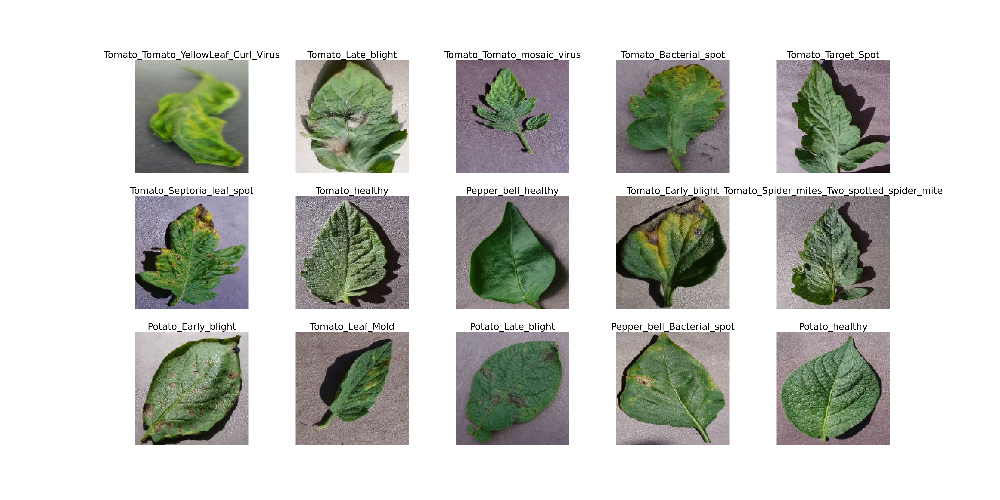
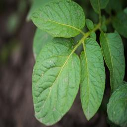
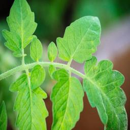
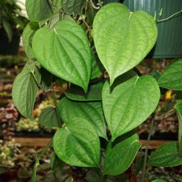

# Plant Diseases Classification
The "Plant Diseases Classification" project aims to leverage advanced computer vision techniques to detect and classify various diseases affecting plants. With the increasing need for sustainable agriculture, early detection of plant diseases plays a crucial role in minimizing crop losses and ensuring food security. This project offers a comprehensive solution that combines image processing, deep learning, and data analysis to accurately identify plant diseases based on visual symptoms.
## Description
The menace of plant diseases threatens global food security and the sustainability of agriculture. Swift and accurate disease detection is imperative to minimize their impact on crop yields and maintain a stable food supply. This small project leverages the "Plant Village" dataset (https://www.kaggle.com/datasets/arjuntejaswi/plant-village), comprising 20,000 images categorized into 15 disease classes across Potato, Tomato, and Pepper plants. Employing Transfer Learning via a CNN architecture yielded remarkable outcomes. The model achieved a commendable **99% classification F1-score** and a **0.99 weighted mean AUC-ROC score**. Notably, the model encompassed around 50,000 parameters, with only **26,000 being trainable**, resulting in efficient training within 10 epochs using RTX 3050 GPU. 
## Key Features
- Utilizes state-of-the-art deep learning models for image classification.
- Supports multi-class classification of plant diseases across a diverse range of crops.
- Offers insights into disease prevalence, distribution, and severity through data visualization.
- Enables further customization and expansion with easy-to-follow code and documentation.
## Libraries and framework
In this project, Tensorflow framework was used for training and evaluating model. Below are some neccessary libraries in this project:
<pre>
import os
import shutil
import time
import numpy as np
import pandas as pd
import seaborn as sns
import matplotlib.pyplot as plt
from sklearn.metrics import roc_curve, auc, roc_auc_score

import tensorflow as tf
from tensorflow import keras
from tensorflow.keras import layers, models
from tensorflow.keras import Model
from tensorflow.keras import optimizers
from tensorflow.keras.applications import ResNet50, InceptionV3, ResNet101
from tensorflow.keras.callbacks import ModelCheckpoint, TensorBoard, EarlyStopping, ReduceLROnPlateau
  
from keras.models import Sequential
from keras.layers import Dense, Dropout, Flatten, BatchNormalization
from keras.layers import Conv2D, MaxPooling2D
</pre>
## Plant Diseases Visualization
In this section, we are going to explore some aspects of the dataset. The dataset contains exactly 20638 256x256 RGB images belonging to 15 classes:
<pre>
  ['Pepper_bell_Bacterial_spot',
 'Pepper_bell_healthy',
 'Potato_Early_blight',
 'Potato_Late_blight',
 'Potato_healthy',
 'Tomato_Bacterial_spot',
 'Tomato_Early_blight',
 'Tomato_Late_blight',
 'Tomato_Leaf_Mold',
 'Tomato_Septoria_leaf_spot',
 'Tomato_Spider_mites_Two_spotted_spider_mite',
 'Tomato_Target_Spot',
 'Tomato_Tomato_YellowLeaf_Curl_Virus',
 'Tomato_Tomato_mosaic_virus',
 'Tomato_healthy']
</pre>

Potato, tomato, and pepper leaves exhibit distinct characteristics that set them apart. At first, let me describe some details about the differences between leaves of Potato, Tomato and Pepper. It is worth to know the differences between these plants before jumping into explore their diseases:
- **Potato** leaves are identifiable by their compound nature, featuring multiple leaflets arranged along a central stem. These leaflets tend to be either oval or lance-shaped, displaying shades of light to dark green and a soft texture.
- **Tomato** leaves, on the other hand, are also compound but bear serrated leaflets, often with a medium to dark green hue. These leaves possess a rough texture due to a slight hairiness.
- **Pepper** leaves may have either simple or compound forms, with varying shapes such as lance, elliptical, or heart-shaped. They are typically smooth-edged and sport a medium to dark green coloration. The texture of pepper leaves is notably smoother than that of tomatoes.

  
  
  

